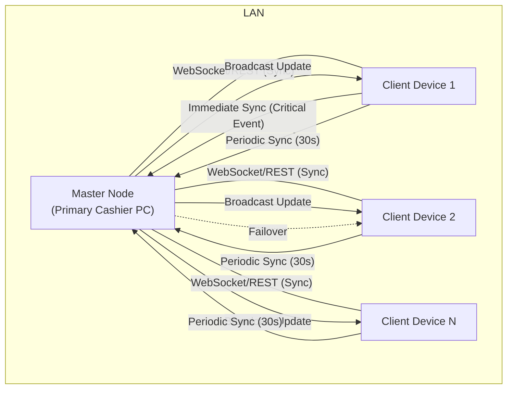

# Architecture – Retail Management System Backend

This document provides an overview of the backend architecture, including navigation, state management, and UI structure.

---

## High-Level Architecture
- Flask + Flask-SocketIO backend
- Modular structure: app (models, routes, services, utils), tests, requirements
- SQLite for local storage (offline-first)
- REST and WebSocket APIs

## Master-Client Architecture
- **Master Node:** Primary cashier PC (server) on the LAN. Handles data consistency, conflict resolution, and acts as the sync hub.
- **Sync Clients:** All other devices connect to the Master. Each device maintains its own local SQLite database.
- **Failover:** If the Master PC shuts down, a backup client is promoted to Master. Device ID logic and role switching ensure continuity.
- **Failover and Device Reconnection (Backend Implementation):**
    - Each device registers with the backend, announcing its device_id and role (master/client).
    - Devices send periodic heartbeats to detect master failure.
    - On master failure, clients use a deterministic rule (e.g., lowest device_id) to elect a new master.
    - The new master announces itself to all devices via WebSocket.
    - When the original master returns, it can rejoin as a client or reclaim master status (with conflict resolution).
    - All role changes and elections are logged for audit and troubleshooting.
    - The system is extensible for more advanced election and reconnection strategies.

## Sync Logic & Data Flow
- **Periodic Sync:** Every device runs a background sync task every 30 seconds. Devices send unsynced changes to the master and receive updates/deltas from the master. Ensures all data is reconciled within 30 seconds.
- **Immediate Sync for Critical Events:** When a critical event occurs (e.g., product goes out of stock), the client immediately sends the update to the master. The master processes the change and instantly broadcasts the update to all clients via WebSocket. All devices update their local DB and UI in real time.
- **Conflict Resolution:** If two devices attempt to process the last item at the same time, the master node resolves the conflict (first-come, first-served based on timestamp). The master notifies all clients of the outcome immediately.
- **Audit Trail:** All sync operations, especially critical events, are logged for audit and troubleshooting. Each change is linked to the originating user/device.
- **Backend Periodic Sync Implementation:**
    - The backend runs a background scheduler (every 30 seconds) using a dedicated SyncTasks class.
    - On each interval, the SyncManager queries all pending SyncEvent records in the database.
    - Each event is broadcast to all connected clients via WebSocket (`sync_update` event).
    - After successful broadcast, events are marked as 'synced' in the database.
    - This ensures all devices receive regular updates, even if they missed a real-time event.
    - The system is extensible to support per-device sync status and advanced error handling in the future.
- **Immediate Sync for Critical Events (Backend Implementation):**
    - When a critical event (e.g., stock depletion) is received, the backend immediately broadcasts it to all connected clients via WebSocket (`critical_event` event).
    - The event is marked as 'synced' in the database after broadcast.
    - This ensures all devices are updated in real time for critical changes.
    - All immediate syncs are logged for audit and troubleshooting.
    - Reliability can be enhanced by requiring client acknowledgements and retrying failed broadcasts.
- **Conflict Resolution (Backend Implementation):**
    - When two or more events attempt to update the same record, the backend applies a first-come, first-served policy based on event timestamp.
    - The master node (SyncManager) uses the ConflictResolver service to compare the incoming event with the current record/event.
    - The event with the earliest timestamp is accepted; others are rejected.
    - All conflict resolutions are logged for audit and troubleshooting.
    - The system is extensible to support more advanced strategies (e.g., merging, user intervention) in the future.
- **Error Handling and Audit Trail (Backend Implementation):**
    - All sync operations (REST, WebSocket, conflict resolution, failover, etc.) are wrapped in robust error handling (try/except blocks).
    - On error, the operation is logged to the SyncAuditLog model with context (operation, device, event, timestamp, details).
    - All successful operations are also logged for traceability and compliance.
    - The audit trail enables full traceability of all sync activity and errors for compliance and troubleshooting.
    - The system is extensible to support external log aggregation or alerting in the future.

## Communication
- **WebSocket:** Used for real-time updates and critical event broadcasts.
- **REST API:** Used for certain operations and as a fallback for sync.

## User Experience
- All devices see stock changes (especially out-of-stock) reflected in real time.
- Users are notified immediately if an attempted action cannot be completed due to a conflict or out-of-stock status.

---

## Master-Client Sync Architecture Diagram

### Summary
- All devices maintain a local SQLite DB.
- Periodic sync (every 30s) ensures regular reconciliation.
- Critical events (like stock depletion) are synced and broadcast immediately.
- Master node handles conflict resolution and failover.
- Real-time updates are pushed to all clients.

---

## Step-by-Step Sync Protocol

### 1. Periodic Sync (Every 30 Seconds)
1. Each device starts a background timer (30s interval).
2. On each tick:
   - Device collects all unsynced changes (writes) since last sync.
   - Device sends these changes to the master node (WebSocket or REST).
   - Master node processes incoming changes, applies them, and resolves any conflicts.
   - Master node responds with any new updates/deltas for the client.
   - Client applies updates to its local DB.
   - Both sides log the sync for audit.
   - **Backend:**
     - A background scheduler triggers the periodic sync logic in SyncManager.
     - All pending SyncEvents are broadcast to clients and marked as 'synced'.
     - If a broadcast fails, the event remains 'pending' and will be retried on the next interval.

### 2. Immediate Sync for Critical Events
1. When a critical event occurs (e.g., product goes out of stock):
   - Client immediately sends the event/change to the master node.
   - Master node processes the event and updates its DB.
   - Master node broadcasts the update to all connected clients via WebSocket.
   - All clients update their local DB and UI in real time.
   - If a conflict is detected (e.g., two clients try to sell the last item):
     - Master resolves based on timestamp (first-come, first-served) or priority.
     - Master notifies all clients of the outcome.
   - **Backend:**
     - The SyncManager's `immediate_sync` method is called when a critical event is received.
     - The event is broadcast to all clients as a `critical_event` via WebSocket and marked as 'synced'.
     - All immediate syncs are logged for audit and troubleshooting.
     - Reliability can be enhanced by requiring client acknowledgements and retrying failed broadcasts.

### 3. Failover
1. If the master node goes offline:
   - **Backend:**
     - Devices register and announce their role (master/client) via WebSocket.
     - Devices send periodic heartbeats to detect master failure.
     - On master failure, a new master is elected and announced to all devices.
     - All role changes and elections are logged for audit and troubleshooting.

### 4. Error Handling
- **Backend:**
  - All sync operations and errors are logged to the SyncAuditLog model for traceability.
  - Robust error handling ensures failed operations are retried or queued for later.
  - The audit trail enables compliance, troubleshooting, and external review.

### Conflict Resolution
- **Backend:**
  - When a sync event is received, SyncManager checks for an existing event/record for the same target.
  - ConflictResolver determines the winner based on timestamp (first-come, first-served).
  - The winning event is applied; others are rejected and logged.
  - All outcomes are logged for audit and troubleshooting.

---

*Update this file as the architecture and sync protocol evolve or new modules are added.* 